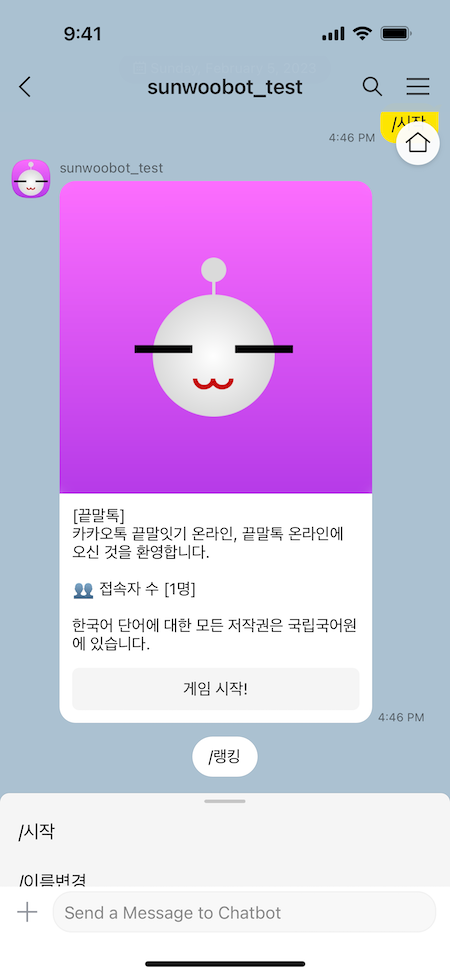
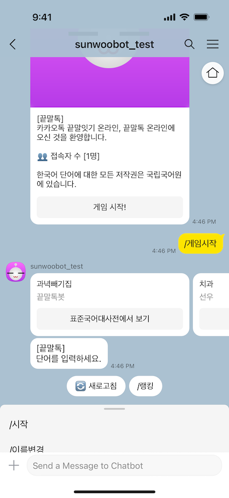
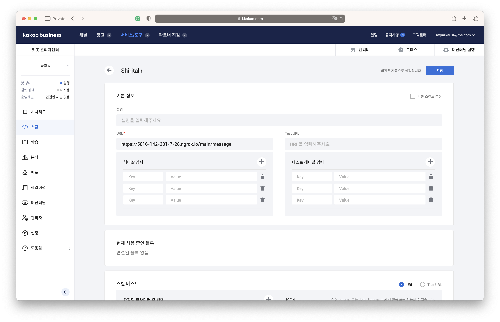

# shiritalk2

🤖 끝말톡 카카오 i 오픈빌더 온라인 끝말잇기 챗봇




## 설치

```
python3 -m venv myvenv
source myvenv/bin/activate
python3 -m pip install --upgrade pip
pip install -r requirements.txt
python manage.py migrate
python manage.py updatedict
python manage.py runserver 0.0.0.0:51000
```

### 카카오 i 오픈빌더 연동

다음 문서를 참조하십시오.
https://docs.google.com/document/d/1vtA1GOWMKAIgeBb8bv9eA15m35fTqD-Xs1rh9lLYpfs/view
스킬 생성 시 CLOSER 관련 정보 대신 다음을 입력합니다:


- **스킬명**: **Shiritalk** (다른 이름을 입력해도 문제없습니다.)
- **URL**: https://yourdomain.com/main/message (*yourdomain.com*을 호스트 이름 또는 IP 주소로 바꾸십시오.)
